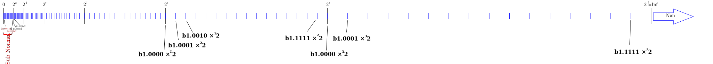
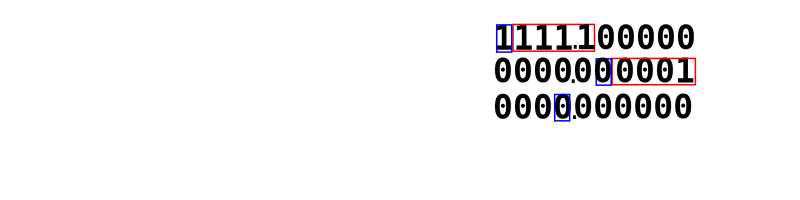

# **Introduction**

I found that most of the books or web sites teaching C to beginners doesn&#39;t explain the subtle part of  the concepts in C clear enough or put enough emphasis/warning on them. Those concepts will usually trap beginners. Once you mastered all these subtle concepts then you will suddenly realize that actually C is a language with just a small number of  keywords and concepts to memorize. And then you will also start to appreciate the minimalist design of C. This series of posts is not intended to be a complete tutorial of the C language but it can be used as supplementary materials to those tutorials.  Lets&#39; talk about data type first...

# **C Only Has One Data Type: Number**

Do you know what this means?
<pre>
char **var[12][3];
</pre>
If you know the answer, then skip this part and first half of part 2, if not, after finish reading, you will find it very easy to decode it.

It can be said that C only have one kind of built-in data types which are NUMBERs. User can define new data types using number types as basic building blocks according to some rules which I summarize them into three rules:

1. Grouping data together in some ways (array, structure and union).
2. Treating the memory location(the address) of data as a kind of data (pointer).
3. Applying  rule no.1 or 2 to also the new data types (arrays, structures, unions and pointers) just created.

Because of rule no.3 (which can be applied repeatedly on new data type just created), things can be made really complicated. And the counter-intuitive way C declare this things make it confusing for beginners (e.g. <code>char **var[12][3]</code> -- it will be shown how to decode things like this later)

In other words, all data type in C is of the form:

some basic built-in type(s) (+ rule(s))

In C, there are only 2 main categories of numbers (whole number and floating point number) and under these 2 categories they are sub-divided by their sizes and whether they support sign(positive/negative) or not:

1. Whole Number
- e.g. <code>long long, signed int, unsigned int, short...</code>

2. Floating Point Number
- e.g. <code>float, double...</code>

# **Even Numeric Literals (Constants) Have Sizes**

**Warning: Numeric literal constants appeared in C statements also get data types mentioned above associated with them too. The rules that apply to variables of a certain type also apply to constants of the same type.** For example:
<pre>
long long v;
long long v1;

v = 0xfffffffe + 2ll; // the constant 2 is of &#39;long long&#39; type
v1= 0xfffffffe + 2;
printf(&quot;%lld %lld\n&quot;, v, v1);
</pre>
program output:
<pre>
4294967296 0
</pre>
<pre>
if (1/2 &gt; 0) 
  printf(&quot;yes\n&quot;);
else
  printf(&quot;no\n&quot;);

if (1.0/2 &gt; 0)
  printf(&quot;yes&quot;\n);
else
  printf(&quot;no\n&quot;);
</pre>
program output:
<pre>
no
yes
</pre>

# **Decimal Floating Point Number to Binary Floating Point Number Rounding**

<pre>
float f;
double d;

f = 0.5;
d = 0.5;

if (f==d)
   printf("equal\n"); // This path is taken:  0.5(decimal) = 0.1(binary) 
else
   printf("not equal\n");

f = 0.7;
d = 0.7;

if (f==d)
   printf("equal\n");
else
   printf("not equal\n"); // This path is taken: 0.7(decimal) = 0.1011001100110....(binary, 0110 repeat) 
                          // float and double can only approximate this no. but in different precision
</pre>

This program shows the internals of double and float after decimal number 0.7 is assigned to them:
<pre>
#include &lt;stdio.h&gt;

// value = -1^sign * 2^(exp-127) * 1.bbbbbb.... (binary decimal no., total 23 bs)
typedef struct {
	unsigned int fraction : 23; // represent the binary digits(the bs) in this binary decimal no. 1.bbbbbbbb...
	unsigned int exp : 8;       // minus this no. by 127 to get real exponent no.
	unsigned int sign : 1;      // sign bit : 0=positive 1=negative
}float_; 

typedef struct {
	unsigned long fraction : 52; 
	unsigned long exp : 11;     // minus this no. by 1023 to get real exponent no.
	unsigned long sign : 1;
}double_;

float f = 0.7;
double d = 0.7;

void printBinary(unsigned long l, int len)
{
	int i;
	char bits[]={'0','1'};
	for (i=len-1; i>=0; i--)
	{
		printf("%c", bits[(l>>i) & 1l]);
	}
}

void main()
{
	float_ *pf_ = (float_*)&f;
	double_ *pd_ = (double_*)&d;

 	printf("-1^");
	printBinary(pf_->sign, 1);
	printf(" * 2^%d * b1.", pf_->exp-127);
	printBinary(pf_->fraction, 23); printf("\n");

	printf("-1^");
	printBinary(pd_->sign, 1);
	printf(" * 2^%d * b1.", pd_->exp-1023);
	printBinary(pd_->fraction, 52); printf("\n");

}
</pre>

Output:
<pre>
-1^0 * 2^-1 * b1.01100110011001100110011
-1^0 * 2^-1 * b1.0110011001100110011001100110011001100110011001100110
</pre>

# Sub Normal And Inf/Nan Numbers

This program shows the [sub normal](https://en.wikipedia.org/wiki/Floating-point_arithmetic#Subnormal_numbers) and the [inf/nan](https://en.wikipedia.org/wiki/Floating-point_arithmetic#Infinities) floating point numbers:
<pre>
#include &lt;stdio.h&gt;

// value = -1^sign * 2^(exp_biased-127) * 1.bbbbbb.... (binary decimal no., total 23 bs)
typedef struct {
	unsigned int fraction : 23; // represent the binary digits(the bs) in this binary decimal no. 1.bbbbbbbb...
	unsigned int exp_biased : 8;  // minus this no. by 127 to get real exponent no.
	unsigned int sign : 1;      // sign bit : 0=positive 1=negative
}float_; 

typedef struct {
	unsigned long fraction : 52; 
	unsigned long exp_biased : 11;     // minus this no. by 1023 to get real exponent no.
	unsigned long sign : 1;
}double_;

void printBinary(unsigned long l, int len)
{
	int i;
	char bits[]={'0','1'};
	for (i=len-1; i>=0; i--)
	{
		printf("%c", bits[(l>>i) & 1l]);
	}
}

void printfloat_(float_ *pf_)
{			
	printf("sign fraction                exp\n");
	
	// Print out raw bit
	printBinary(pf_->sign, 1);	        printf("    ");
	printBinary(pf_->fraction, 23); 	printf(" ");
	printBinary(pf_->exp_biased, 8);	printf(" ");
	printf("\n");
}

void printdouble_(double_ *pd_)
{
	printf("sign fraction                                             exp\n");
	
	printBinary(pd_->sign, 1);        printf("    ");
	printBinary(pd_->fraction, 52);   printf(" ");
	printBinary(pd_->exp_biased, 52); printf("\n");
}

void main()
{
	float_ f_sub_;
	f_sub_.exp_biased = -127+127; // exp_biased = 0 = sub normal, exponent = -126
	f_sub_.fraction = 1; // significant digit = 0 when sub normal 
	f_sub_.sign = 0;
	
	float_ f_nor_;
	f_nor_.exp_biased = -126+127; // exponent = -126
	f_nor_.fraction = 1;
	f_nor_.sign = 0;
	
	printfloat_(&f_sub_);
	printfloat_(&f_nor_);
	
	float *pf_sub = (float*)&f_sub_;
	float *pf_nor = (float*)&f_nor_;	
	*pf_sub *= 2; // multiple both by 2 and see what happen to the raw bits
	*pf_nor *= 2;
	
	printfloat_(&f_sub_);
	printfloat_(&f_nor_);
	
	float_ f_inf_;
	f_inf_.exp_biased = 128+127; // exponent = 128 = inf/nan
	f_inf_.fraction = 0;
	f_inf_.sign = 0;
	
	float_ f_nan_;
	f_nan_.exp_biased = 128+127; // exponent = 128 = inf/nan
	f_nan_.fraction = 1;
	f_nan_.sign = 0;
	
	float *pf_inf = (float*)&f_inf_;
	float *pf_nan = (float*)&f_nan_;
	
	printf("%e\n", *pf_inf); // see how printf handle these numbers.
	printf("%e\n", *pf_nan);
}
</pre>

Output:
<pre>
sign fraction                exp
0    00000000000000000000001 00000000 <-- sub normal number(exp field all '0's), = 0.00000000000000000000001 * 2^126
sign fraction                exp
0    00000000000000000000001 00000001 <-- normal number, = 1.00000000000000000000001 * 2^126
(both numbers are multiplied by 2)
sign fraction                exp
0    00000000000000000000010 00000000 <-- notice that fraction is multipled by 2
sign fraction                exp
0    00000000000000000000001 00000010 <-- notice that faction doesn't change but exp is added by 1
inf  <-- exp field all '1's, fraction field =0
nan  <-- exp field all '1's, fraction field =1
</pre>

Using a lesser bit floating point number (this format is not standard but its rules follow those used by float and double) to show how the number of bits in exp and fraction field affect its distribution on real number line:

1 sign bit, 3 exp bits, 4 fraction bits
| exp bits | value |
| -----    | ----- |
| 000      | 2^-2 (sub normal, most significant bit = 0) |
| 001      | 2^-2  |
| 010      | 2^-1  |
| 011      | 2^0  |
| 100      | 2^1  |
| 101      | 2^2  |
| 110      | 2^3  |
| 111      | (inf/nan)  |

Click on the image and click "Raw" button to view the picture in seperate browser window so that you can zoom in/out:

Noted how the no. of bits in exp and fraction fields affect the distribution of marks(the numbers it can represent) in the number line:

The no. of the black marks (taller one) (and how far they can extend to the right and how many they can be inerted before the zero point) are affected by the range the number exp field can represent.

The number of blue marks between black marks is affected by the number of bits in fraction field. The no. of blue marks between any neighbouring black marks are the same.

The largest and smallest number and its significant digits when written without the exponent.

# **There is ONLY 1-D Array in C. There is no Multi-Dimensional Array in C but Nested 1-D Array**

If you know how to analyze the syntax of a what people usually call "multi-dimensional" array&#39;s declaration,  you will agree that it is more appropriate to call it an &#39;nested array&#39; rather then &#39;multi-dimensional array&#39;. An &#39;nested array&#39; is an array whose elements are also arrays. An array of arrays (of arrays...) of something. The word &#39;something&#39; here can be basic data type, structure, union or pointer. **In C, there is only 1-D array.** If you have a array of struct, you can add for example &#39; **<code>.field</code>**&#39; after the array index operator like: &#39;**<code>as[1].field</code>**&#39; to access the field. Similarly, if you have an array of arrays, you access the inner array&#39;s element by attaching one more &#39;**<code>[]</code>**&#39; to access it: e.g. **<code>aa[1][2]</code>**, just like you add a &#39; **<code>.field</code>**&#39; in the case of struct. &#39;**<code>as[1]&#39;</code>** returns you the struct at index 1, **&#39;<code>aa[1]</code>**&#39; returns you the array at index 1. You add **<code>&#39;.field</code>&#39;** or &#39;**<code>[]</code>**&#39; to further access its internal objects.

For example,
- Converting **<code>int a[4]</code>** into English: **<code>a</code>** is an 4-element array (of integers).
- Converting **<code>int a2d[3][4]</code>** into English: **<code>a2d</code>** is an 3-element array (of 4-element arrays (of integers)).
- Converting **<code>int a3d[2][3][4]</code>** into English: **<code>a3d</code>** is an 2-element array (of 3-element arrays (of 4-element arrays (of integers))).

or:
- Converting **<code>int a[4]</code>** into English: **<code>a</code>** is an array (of 4 integers).
- Converting **<code>int a2d[3][4]</code>** into English: **<code>a2d</code>** is an array (of 3 arrays (of 4 integers)).
- Converting **<code>int a3d[2][3][4]</code>** into English: **<code>a3d</code>** is an array (of 2 arrays (of 3 arrays (of 4 integers))).

or
- ...
- Converting **<code>int a3d[2][3][4]</code>** into English: 4 integers get together to form an array and 3 instances of this array get together to form an nested array and 2 instances of this nested array get together to form a multi-layer nested array and lets&#39; call it **<code>a3d</code>**.

(This web site can convert your C declaration into English [https://cdecl.org/](https://cdecl.org/))

Visualizing **<code>a3d[2][3][4]</code>**:

 or

The memory layout for the 3-D array <code>a3d</code> will look like this, the integer on the top will be located at low memory address:

<table cellspacing="0" cellpadding="4">
 <colgroup><col width="32*">
 <col width="36*">
 <col width="52*">
 <col width="65*">
 <col width="72*">
 </colgroup><tbody>
<tr>
  <td rowspan="24" width="12%">

<i>a3d</i>

</td>
  <td rowspan="12" width="14%">

<i>a3d[0]</i>

</td>
  <td rowspan="4" width="20%">

<i>a3d[0][0]</i>

</td>
  <td width="25%" valign="TOP">

<i>a3d[0][0][0]</i>

</td>
  <td width="28%" valign="TOP">

<b>int</b>

</td>
 </tr>
<tr valign="TOP">
  <td width="25%">

<i>a3d[0][0][1]</i>

</td>
  <td width="28%">

<b>int</b>

</td>
 </tr>
<tr valign="TOP">
  <td width="25%">

<i>a3d[0][0][2]</i>

</td>
  <td width="28%">

<b>int</b>

</td>
 </tr>
<tr valign="TOP">
  <td width="25%">

<i>a3d[0][0][3]</i>

</td>
  <td width="28%">

<b>int</b>

</td>
 </tr>
<tr>
  <td rowspan="4" width="20%">

<i>a3d[0][1]</i>

</td>
  <td width="25%" valign="TOP">

<i>a3d[0][1][0]</i>

</td>
  <td width="28%" valign="TOP">

<b>int</b>

</td>
 </tr>
<tr valign="TOP">
  <td width="25%">

<i>a3d[0][1][1]</i>

</td>
  <td width="28%">

<b>int</b>

</td>
 </tr>
<tr valign="TOP">
  <td width="25%">

<i>a3d[0][1][2]</i>

</td>
  <td width="28%">

<b>int</b>

</td>
 </tr>
<tr valign="TOP">
  <td width="25%">

<i>a3d[0][1][3]</i>

</td>
  <td width="28%">

<b>int</b>

</td>
 </tr>
<tr>
  <td rowspan="4" width="20%">

<i>a3d[0][2]</i>

</td>
  <td width="25%" valign="TOP">

<i>a3d[0][2][0]</i>

</td>
  <td width="28%" valign="TOP">

<b>int</b>

</td>
 </tr>
<tr valign="TOP">
  <td width="25%">

<i>a3d[0][2][1]</i>

</td>
  <td width="28%">

<b>int</b>

</td>
 </tr>
<tr valign="TOP">
  <td width="25%">

<i>a3d[0][2][2]</i>

</td>
  <td width="28%">

<b>int</b>

</td>
 </tr>
<tr valign="TOP">
  <td width="25%">

<i>a3d[0][2][3]</i>

</td>
  <td width="28%">

<b>int</b>

</td>
 </tr>
<tr>
  <td rowspan="12" width="14%">

<i>a3d[1]</i>

</td>
  <td rowspan="4" width="20%">

<i>a3d[1][0]</i>

</td>
  <td width="25%" valign="TOP">

<i>a3d[1][0][0]</i>

</td>
  <td width="28%" valign="TOP">

<b>int</b>

</td>
 </tr>
<tr valign="TOP">
  <td width="25%">

<i>a3d[1][0][1]</i>

</td>
  <td width="28%">

<b>int</b>

</td>
 </tr>
<tr valign="TOP">
  <td width="25%">

<i>a3d[1][0][2]</i>

</td>
  <td width="28%">

<b>int</b>

</td>
 </tr>
<tr valign="TOP">
  <td width="25%">

<i>a3d[1][0][3]</i>

</td>
  <td width="28%">

<b>int</b>

</td>
 </tr>
<tr>
  <td rowspan="4" width="20%">

<i>a3d[1][1]</i>

</td>
  <td width="25%" valign="TOP">

<i>a3d[1][1][0]</i>

</td>
  <td width="28%" valign="TOP">

<b>int</b>

</td>
 </tr>
<tr valign="TOP">
  <td width="25%">

<i>a3d[1][1][1]</i>

</td>
  <td width="28%">

<b>int</b>

</td>
 </tr>
<tr valign="TOP">
  <td width="25%">

<i>a3d[1][1][2]</i>

</td>
  <td width="28%">

<b>int</b>

</td>
 </tr>
<tr valign="TOP">
  <td width="25%">

<i>a3d[1][1][3]</i>

</td>
  <td width="28%">

<b>int</b>

</td>
 </tr>
<tr>
  <td rowspan="4" width="20%">

<i>a3d[1][2]</i>

</td>
  <td width="25%" valign="TOP">

<i>a3d[1][2][0]</i>

</td>
  <td width="28%" valign="TOP">

<b>int</b>

</td>
 </tr>
<tr valign="TOP">
  <td width="25%">

<i>a3d[1][2][1]</i>

</td>
  <td width="28%">

<b>int</b>

</td>
 </tr>
<tr valign="TOP">
  <td width="25%">

<i>a3d[1][2][2]</i>

</td>
  <td width="28%">

<b>int</b>

</td>
 </tr>
<tr valign="TOP">
  <td width="25%">

<i>a3d[1][2][3]</i>

</td>
  <td width="28%">

<b>int</b>

</td>
 </tr>
</tbody></table>

Total 2x3x4 = 24 integers.

In the declaration of a nested array,  the no. in the square bracket nearest to the variable identifier is the top level array&#39;s element count.

An nested array&#39;s element is accessed like this in a C statement:
<pre>
i = a[0][1][3];
</pre>
But actually <code>a</code> is an array of arrays of arrays, the expression can be equivalently re-written as:
<pre>
i = ((a[0])[1])[3];
</pre>
This emphasizes how the expression is evaluated form top level array downwards to the bottom level array. This reveals the fact that <code>a</code> is actually an array of arrays of arrays behind the scene. In this expression the sub expression <code>a[0]</code> and <code>a[0][1]</code> can also appear by themselves alone in C statement, like:
<pre>
some_variable1 = a[0];
some_variable2 = a[0][1];
</pre>
**In C, the syntax for (nested) array declaration make use of the syntax for accessing (nested) array element  in normal C statement**. For example, to analyze **<code>int a[2][3][4]</code>**, first re-write it as **<code>int ((a[2])[3])[4]</code>** to emphasize the order of evaluation. And then, the expression **<code>int ((a[2])[3])[4]</code>** can be analyzed starting from the inner most bracket like this:

1. **<code>a[2]</code>**: the **&#39;<code>[2]</code>&#39;** array index operator operating on **<code>a</code>** means object **<code>a</code>** is an array of **2** objects, the expression  **<code>(a[2])</code>** is evaluated as one such object.
2. **<code>(a[2])[3]</code>**: object **<code>(a[2])</code>** is an array of **3** objects, the expression **<code>((a[2])[3])</code>** is evaluated as one such object.
3. **<code>((a[2])[3])[4]</code>**: object **<code>((a[2])[3])</code>** is an array of **4** objects, the expression **<code>((a[2])[3])[4]</code>** is evaluated as one such object.
4. **<code>int ((a[2])[3])[4]</code>**: object **<code>((a[2])[3])[4]</code>** is an integer.

By substituting no.4 into no.3, the original 4 statements reduced into 3 statements, with the first two remain unchanged:
1. ...
2. ...
3. **<code>((a[2])[3])[4]</code>**: object **<code>((a[2])[3])</code>** is an array of **4** ~~object~~integers.

By substituting no.3 into no.2, we get:
1. ...
2. **<code>(a[2])[3]</code>**: object **<code>(a[2])</code>** is an array of **3** ~~object~~arrays of 4 integers.

And finally we reduce it into:
1. **<code>a[2]</code>**: object **<code>a</code>** is an array of **2** ~~object~~arrays of 3 arrays of 4 integers.

Which explains why the no. in the square bracket nearest to the variable identifier is the top level array&#39;s length.

It may seem that it is not necessary to apply this kind of lengthy analysis to understand nested array declaration but when it mixed with pointer operators, then it is very useful.

The declaration statement is like a demo walking you through the process of how an object of simpler known type is accessed from a variable of complex unknown type in order to let you know what type the variable is (i.e. how that complex type is constructed from the simpler known type). This is commonly called &#39;declaration reflects use&#39;. For example:
<pre>
int a[2][3][4];
</pre>
Which is like saying that:

If the &#39;get element operator -- **<code>[]</code>**&#39; is applied 3 times successively (**<code>a[][][]</code>**) on &#39; **<code>a</code>**&#39;, then we will get a **<code>int</code>** object.

In this example the variable of unknown type is **<code>a</code>** and the known type of object is **<code>int</code>**.

It let you know how something is constructed by showing you the procedure of disassembling it.

a3d can also be declared like this:
<pre>
typedef int       A4[4];
typedef A4      A3x4[3];
typedef A3x4  A2x3x4[2];

A2x3x4 a3d;
</pre>
It starts from the inner most array to the outer most array, opposite to this style: **<code>int a3d[2][3][4]</code>**. And it is the later style that make it difficult for beginner (especially when mixed with pointer operators). It is because it starts from describing the final composite type(in this case the outer most array -- an 2-element array of something yet to be defined) and then successively decomposes it down to the built-in basic type(in this case **<code>int</code>** ) in a single expression. A good understanding of expression evaluation is needed.

Of cause you can use this &#39;array of arrays of ...&#39; thing to represent 2-D or n-D matrix (they are truly multi-dimensional array conceptually). Just remember that for example in a 2-D matrix, extracting a row from it is very different from extracting a column from it. One is easier or harder then the other depends on whether you define a row as the top level array element or column as the top level array element. For example:
<pre><code>
int matrix_2d[2][3]; // a 2-D matrix of 2 rows(indexes: 0,1), 3 columns(indexes 0,1,2) 
                     // --- row as the top level array element

// to extract the whole row of index no.1
some_variable1 = matrix_2d[1];

// to extract the whole column of index no.2
some_variable2 = matrix_2d[][2]; // no such syntax in C, have to extract element by 
                                 // element with a for loop or something similar.
</code></pre>
That is why nested array is a better name then multi-dimensional array. Because the word mutli-dimensional usually implies that all dimensions have the same status, meaning if an operation can be applied on one dimension then it can also be applied on any of the other dimensions.

The initialization for nested array is like this:
<pre>
int a3d[2][3][4]=
{
  {
      {1,2,3,4},      //a3d[0][0]
      {5,6,7,8},      //a3d[0][1]
      {9,10,11,12}    //a3d[0][2]
   }, //a3d[0]
   {
     {13,14,15,16},   //a3d[1][0]
     {17,18,19,20},   //a3d[1][1]
     {21,22,23,24}    //a3d[1][2]
   }  //a3d[1]
}; //a3d
</pre>
which reflects the nested nature of it.

[Part 2](C_Concepts_Part2.md)

[Up](README.md)
