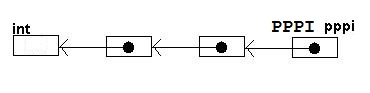
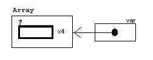
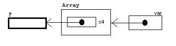
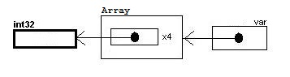

# **C Concepts: Part 2**

## **Variable Declaration Involving Pointer Dereference Operators &#39;<code>\*</code>&#39;**

The simplest C pointer variable declaration:
<pre>
int* pi;
</pre>
which means pi is a pointer to **<code>int</code>**.

Then do you know what does the following means?
<pre>
int* pi, var;
</pre>
If you think that both **<code>pi</code>** and **<code>var</code>** are of the same type -- pointer to **<code>int</code>** , then your are **WRONG**!

The answer is, this is equivalent to:
<pre>
int* pi;
int var;
</pre>
Like array declaration, the pointer dereference operator &#39;**<code>\*</code>**&#39; in a declaration statement is used like when it is used in normal C statement (&quot;declaration reflects use&quot;). Therefore the first declaration on this post can be re-written as:
<pre>
int (*pi);
</pre>
to emphasize the order of evaluation. This declaration statement can be analyzed like this:

Everything to the right of &#39;<code>**int**</code>&#39; until the semi-colon is one complete C expression which the resulting object of the evaluation will be assigned &#39;**<code>int</code>**&#39; as its type. Now this expression is &#39;**<code>(\*pi)</code>**&#39;.
1. In this expression **<code>pi</code>** is acted upon by a dereference operator which means **<code>pi</code>** is a pointer to some object.
2. And then nothing more to evaluate so we finished evaluating the entire expression which  is evaluated to be that &#39;some object&#39; in step 1. And then this &#39;some object&#39; is assigned &#39;**<code>int</code>**&#39; as its type.
3. Substitute the result form step 2 to step 1, we get: **<code>pi</code>** is a pointer to some ~~object~~ **<code>int</code>**.

Although simple declaration like this don&#39;t need this kind of lengthy analysis in order to understand. However when the expression is mixed with several array index operators and dereference operators then it will be very useful.

And therefore the &#39;<code>\*</code>&#39; sign is better put next to the variable identifier &#39; **<code>pi</code>**&#39;  rather then to &#39; **<code>int</code>**&#39; which I do it in purpose to confuse readers who don&#39;t know about this.
<pre>
int *pi; // better then &#39;int*  pi;&#39;
</pre>
Because this statement actually means &#39;Dereferencing **<code>pi</code>** will get a **<code>int</code>** , so you know what type **<code>pi*</code>* is.&#39;.

And if you want to declare 2 variables both as &#39;pointer to integer&#39; in one statement:
<pre>
int *pi, *var; // Not &#39;int* pi, var;&#39;
</pre>
which is equivalent to:
<pre>
int *pi;
int *var;
</pre>
The confusion is caused by people wrongly thinking about the declaration syntax as :
<pre>
&lt;Type&gt; &lt;variable name&gt;, &lt;variable name&gt;; // wrong
</pre>
and also because of how the type cast operators look like:
<pre>
void *v;
int *pi;
pi = (int*)v;// type cast v to (int *)
</pre>
and that&#39;s why they wrongly think that the &#39;<code>\*</code>&#39; belongs to the <code>&lt;Type&gt;</code> part. The correct syntax is:
<pre>
&lt;Type&gt; &lt;variable expression&gt;, &lt;variable expression&gt;;
</pre>
The <code>&lt;variable expression&gt;</code> is an expression showing how the variable can be evaluated to a object of <code>&lt;Type&gt;</code>. And <code>&lt;Type&gt;</code> can be any built-in type keywords (<code>**int**</code>, <code>**unsigned char**</code>, <code>**long**</code>...), <code>**typedef** name</code>, <code>**struct** name</code> or <code>**union** name</code>.
e.g.
<pre>
unsigned char **ppc, c;

typedef int **PntPntI;
PntPntI ppi, appi[10];

struct s{
  int v;
};
struct s *ps, as[10];
</pre>
Of course it is quit counter intuitive, but that is the way C variable declaration is designed. Reason may be when writing the compiler, the code used to parse normal C statement can also be re-used to parse declaration statement.

Similar to nested array, pointer itself can also be pointed to by an other pointer, and this other pointer can also be pointed to by some other pointer, and so on..., for example:
<pre>
int i = 0;
int *pi = &amp;i;
int **ppi = &amp;pi;
int ***pppi = &amp;ppi;

***pppi = 88;
printf(&quot;%d %d %d\n&quot;, i, *pi, **ppi);
</pre>
program output:
<pre>
88 88 88
</pre>
The pointer to pointer to pointer to integer declaration:
<pre>
int ***pppi;
</pre>
can be re-written as:
<pre>
int (*(*(*pppi)));
</pre>
to emphasize the order of evaluation of the expression. You can construct and analyze this kind of pointer to pointer (to...) thing by the rules just mentioned for analyzing <code>int (\*pi)</code> above.

You can also do the same thing with typedef:
<pre>
typedef int      *PI;
typedef PI      *PPI;
typedef PPI    *PPPI;

PPPI pppi;
</pre>
Visualizing <code>pppi</code>:

The 3 arrows in the picture correspond to the 3 &#39;<code>\*</code>&#39; operators. These 2 styles of declaration: the &#39;**<code>int \*\*\*pppi</code>**&#39; one and the **<code>typedef</code>**  one are that the former one is describing this picture from right to left (from pointer to pointee) and the later one is from left to right (from pointee to pointer).

## **Variable Declaration Involving Both Pointer Dereference Operators &#39;<code>\*</code>&#39; and Array Index Operator &#39;<code>[]</code>&#39;**

The question mentioned in part 1 :

Do you know what this means?
<pre>
char **var[12][3];
</pre>
will discussed here.

The general form of variable declaration is:
<pre>
&lt;Type&gt;  &lt;Expression&gt;;
</pre>
**<code>&lt;Type&gt;</code>** : It can be any C built-in type like **<code>int</code>** , **<code>char</code>** , ... or **<code>struct</code>** or **<code>union</code>** or **<code>typedef</code>** type.

**<code>&lt;Expression&gt;</code>** : An expression that a variable identifier is acted upon by any number of &#39;**<code>[]</code>**&#39; and/or &#39;**<code>\*</code>**&#39; successively on it. &#39;<code>[]</code>&#39; and &#39;<code>\*</code>&quot; are both unary operators(i.e. it takes one operand(input)--takes one input, produces one output). The situation is similar to something like this in mathematics:  <code>g(g(f(g(f(f(x))))))</code>. Where <code>x</code> is a variable, <code>g()</code> and <code>f()</code> is functions. The general pattern will look like:
<pre>
***...var[][][]...
</pre>
(&#39;<code>[]</code>&#39; has higher precedence then &#39;<code>\*</code>&#39;,  brackets can be inserted to change the precedence of operator)

The resulting object evaluated from the expression will get assigned the type of <code>&lt;Type&gt;</code>. The declaration statement is like a demo showing you the procedure of extracting a known type of object from a variable of unknown type.  By showing you the steps to decompose something, you know how something is composed.

For example:

1. <code>char \*\*var[12][3];</code>

2. <code>struct my\_struct \*var[2][3][4];</code>

3. <code>typedef int int32;</code> 
<code>int32 *(*var)[4];</code>

Analysis of the above examples:

1.  <code>char \*\*var[12][3];</code>

Rewrite it to:

<code>char (\*(\*((var[12])[3])));</code>

to emphasize the order of evaluation. Then evaluate it starting from the inner most bracket: 
<code>char (\*(\*(**(var[12])**[3]))); //var is an 12-element array (of what?)</code> 
<code>char (\*(\***((var[12])[3])**)); //var is an 12-element array (of 3-element arrays (of what?))</code> 
<code>char (\***(\*((var[12])[3]))**); //var is an 12-element array (of 3-element arrays (of pointers (to what?)))</code> 
<code>char **(\*(\*((var[12])[3])))**; //var is an 12-element array (of 3-element arrays (of pointers (to pointer (to what?))))</code> 
<code>**char (\*(\*((var[12])[3])))**; //var is an 12-element array (of 3-element arrays (of pointers (to pointer (to char))))</code> 
Done.

2. <code>struct my\_struct \*var[2][3][4];</code>

Rewrite it to: 
<code>struct my_struct (\*(((var[2])[3])[4]));</code> 
Evaluation starts from the variable identifier <code>var</code>&#39;s first operation which is caused by the array index operator&#39;<code>[2]</code>&#39; right next to it.

 

1. <code>var</code> is acted upon by an array index operator &#39;<code>[2]</code>&#39;. That means <code>var</code> is an array and it also tells us it has 2 elements. 2 elements of &#39;something&#39;. Lets&#39; call this &#39;something&#39; &#39;<code>obj1</code>&#39;. So expression <code>(var[2])</code> is evaluated to an <code>obj1</code>.
2. Rewrite <code>(var[2])[3]</code> to <code>obj1[3]</code>. It tells us <code>obj1</code> is an 3-element array of something. Let&#39;s call this &#39;something&#39; <code>obj</code>. So expression <code>(obj1[3])</code> is evaluated to an <code>obj2</code>.
3. Rewrite <code>(obj1[3])[4]</code> to <code>obj2[4]</code>. It tells us obj2 is an 4-element array of something. Let&#39;s call it this &#39;something&#39; &#39;<code>obj3</code>&#39;. So expression <code>(obj2[4])</code> is evaluated to an <code>obj3</code>.
4. Rewrite <code>\*(obj2[4])</code> to <code>\*obj3</code>. A dereference operator is acted on it which suggests that <code>obj3</code> is a pointer to something. Let&#39;s call this &#39;something&#39; &#39;<code>obj4</code>&#39;.  So expression <code>(\*obj3)</code> is evaluated to an <code>obj4</code>.
5. Rewrite <code>(\*obj3)</code> to <code>obj4</code>. No more operator acts upon<code>obj4</code>. We finish our expression evaluation and the evaluation result is <code>obj4</code>. <code>obj4</code> is then assigned to &#39;<code>struct my\_struct</code>&#39; type stated at the front of the declaration statement.

Then we can resolve <code>obj3</code> , <code>obj2</code>, <code>obj1</code> and <code>var</code> by a sequence of substitutions:

1. Substitute no.5 (&#39; <code>obj4</code> is <code>struct my\_struct</code>&#39;) to no.4 ('<code>obj3</code> is a pointer to <code>obj4</code>'). We get &#39;<code>obj3</code> is a pointer to ~~<code>obj4</code>~~<code>struct my\_struct</code>&#39;.
2. Substitute &#39;<code>obj3</code> is a pointer to <code>struct my\_struct</code>&#39; to no.3 ('<code>obj2</code> is an 4-element array of  <code>obj3</code>s'). We get &#39;<code>obj2</code> is an 4-element array of <code>obj3</code> pointers to <code>struct my\_struct</code>&#39;.
3. Substitute &#39;<code>obj2</code> is an 4-element array of pointers to <code>struct my\_struct</code>&#39; to no. 2 ('<code>obj1</code> is an 3-element array of <code>obj2</code>s'). We get &#39;<code>obj1</code> is an 3-element array of ~~<code>obj2</code>~~4-element arrays of pointers to <code>struct my\_struct</code>&#39;.
4. Substitute  &#39;<code>obj1</code> is an 3-element array of 4-element arrays of pointers to pointer to <code>struct my\_struct</code>&#39; to no. 1 ('<code>var</code> is an 2-element array of <code>obj1</code>s'). We get &#39;<code>var</code> is an 2-element array of <code>~~obj1~~</code>3-element arrays of 4-element arrays of pointers to <code>struct my\_struct</code>&#39;
5. <code>var</code> is an 2-element array of 3-element arrays of 4-element arrays of pointers to <code>struct my\_struct</code>.

The methods above demonstrate algorithms (some mechanical ways) of how to convert a declaration in C language into a natural language &#39;English&#39;. It is just merely a translation of some abstract concepts described in an unfamiliar language to a familiar language. All languages are 1-D array of symbols. Understanding means you are able to extract the meanings of these 1-D array of symbols and then build a mental picture of the things it describes in your brain. Let&#39;s use pictures to analyze example 3.

3. <code>typedef int int32;</code> 
<code>int32 \*(\*var)[4];</code>

Rewrite it to:

<code>int32 (*((*var)[4]));</code>

Evaluation starts from the variable identifier <code>var</code>&#39;s first operation caused by the dereference operator which is the operator closest to it.

<code>int32 (\*(**(\*var)**[4])); // I know var is a pointer, but pointer to what?</code>

<code>int32 (\***((\*var)[4])**); // I know var is a pointer to an 4-element array, but array of what?</code>

- Noted that the thick line border question mark box in the previous picture is now enlarged (because now it is known that it is an array, and it needs more space to draw box inside to represent elements) and border changed to thin line in this picture(thick border is used to indicate the focus of the current discussion).

<code>int32 **(\*((\*var)[4]))**; // I know var is a pointer to an 4-element array of pointers, but pointer to what?</code>

<code>**int32 (\*((\*var)[4]))**; // I know var is a pointer to an 4-element array of pointers to int32, yeah!</code>

Visualizing the number of array element:

**Warning:**

The picture above doesn&#39;t means all the things at the left hand side of the &#39; **var**&#39; box will be created not to say **var** will pointing to them as a effect of the declaration statement. The effect of the declaration statement is just reserving a small piece of memory space (usually 4 bytes in 32bit machine) for the pointer variable &#39; **var**&#39; only. It has to be initialized before it can be used.

**&#39;int32 \*(\*var)[4];&#39;** can also be declared with typedef statements:

**typedef int                int32;**

**typedef int32            \*PINT32;**

**typedef PINT32       A4PINT32[4];**

**typedef A4PINT32  \*PA4PINT32;**

**PA4PINT32              var;**

Visualizing this:

**typedef int                int32;**

**typedef int32            \*PINT32;**

 

 **typedef PINT32       A4PINT32[4];**

 

**typedef A4PINT32  \*PA4PINT32;**

 

** PA4PINT32              var;**

 

This 2 approaches arrive at the same final picture. The former one go from the direction of pointer/array to pointee/element. The later go from pointee/element to pointer/array. But there is no way to declare variable from pointee/element to pointer/array in one single statement in C. Here I propose such a syntax that can do that, the general form is:

&lt;Type&gt;(any no. of []or\*)  &lt;variable name&gt;

Example:

| **Pointer/Array → Pointee/Element** | **Pointee/Element → Pointer/Array** |
| --- | --- |
| int a[2][3][4]; | int[4][3][2] a; |
| int \*\*\*pppi; | int\*\*\* pppi; |
| int \*\*\*var[2][3][4]; | int\*\*\*[4][3][2] var; |
| int \*\*(\*var[2][3])[4]; | int\*\*[4]\*[3][2] var; |

### **&#39;[]&#39;  and &#39;\*&#39; When used in Type Casting**

Type casting operator is constructed by a variable declaration statement with the variable taken out and enclosed in brackets.

**int \*(\*var)[2][3];**

type cast operator to cast something to the same type as var:

**(int\*(\*)[2][3])**

It can be also used in function prototype&#39;s argument list:

**void fun(int\*(\*)[2][3], int);**

**void fun(int\*(\*arg1)[2][3], int arg2)**

**{**

**....**

**}**

As the operand for \* at the right hand side, operand for [] is at the left hand side, it will be always in this form ..\*\*\*\*var[][][][]... (brackets can be used to change the order of precedence -- e.g. &#39;\*\*(\*\*var[])[][]&#39;). When var is taken out, there is no other location to insert it back which still make the whole expression syntactically correct. var will be always

1. at the right of all &#39;\*&#39;(s) if any and
2. at the left of all &#39;[]&#39;(s) if any and
3. inside of all bracket(s) if any.

### **Function Return Value Type involve &#39;\*&#39; and &#39;[]&#39;**

Example:
**int fun(void); //return a integer**
**int \*fun(void); // return a pointer to integer**
**int fun(void)[2]; // illegal, array is not allowed as return value, but anyway it means return a 2-element array of integers.**
**int (\*fun(void))[2]; // return a pointer to 2-element array of integers**
**int (\*fun(void))[2][3][4]; //return a pointer to 2-element array of 3-element arrays of 4-element arrays of  integers**
**int \*(\*fun(void))[2];//return a pointer to 2-element array of pointers to integer**

They also follow the &#39;declare reflects use&#39; principle as with variable declaration.

General form:
&lt;type&gt; **...\*(\***** **&lt;function\_name&gt;(&lt;argument list&gt;)**  **** )[].... ****;**
(symbols in underline are optional, brackets can be added to change precedence.)

It is an expression of &#39;[]&#39; and &#39;\*&#39; acting on the inner most expression &#39;&lt;function\_name&gt;(argument list)&#39; successively.The inner most expression &#39;&lt;function\_name&gt;(argument list)&#39; evaluated to be the object returned by the function &#39;function\_name&#39;.

### **Function Pointers**

In C, there are 2 things in total you can do to a existing function, they are:
1. Call it.
2. Get the pointer(address) of it. (and then stored it to a variable.)

For example:
**int fun(void);**

**i = fun();      // call the function. **

- If you just see this line of code alone, you can still tell that &#39;fun&#39; is a name to a function (not a variable) because there is a &#39;()&#39; next to it. Like [], we know that the name next to it the name of an array. However, unlike &#39;[]&#39;,  &#39;()&#39; also has other use: to enforce the order evaluation. What does &#39;()&#39; mean depends on its surroundings.

**pf = &amp;fun;   //or without &#39;&amp;&#39;, get the pointer of the function**

The question is, how to declare the variable **pf?**

It can be declared like this:

**int (\*pf)(void); // just replace &#39;fun&#39; with &#39;(\*pf)&#39;**

and statement calling the function pointed to by **pf** will be like this:
**i = (\*pf)();**

The general idea is, replace the function name with &#39;(\*&lt;pointer name&gt;)&#39;. This also fit the principle used for variable deceleration: &quot;declaration reflects use&#39;. The declaration is actually a demo showing how an identifier(variable identifier or function identifier) of unknown type is used. When you know how it is being used, you should know what type it is. Why function declaration fit this principle is also because function in C always return a single value(even void function return a single void). They can appear in expression that is interchangeable with variables. e.g

**i = a + b \* f(2,v) - 3;    // a , b, f(2,v) and constant 3 represent same kind of things in an expression -- numerical values.**

Therefore function or function pointer can be declared the same way as for variable declaration.

Function pointer is same as other pointer type, there can be array of function pointers, or pointer to function pointer. Function can return function pointer or take function pointer as argument. When used as argument, inside the function prototype the name can be omitted.
 e.g.
**void fun((\*argf)(int i)); **

is equivalent to:

**void fun((\*)(int));**
.
And all these ideas can be chained together in many different ways and even expressed in a single statement which make it very difficult to the beginner. For Examples:

**void (\*(\*apf[4])(int, int (\*)(int)))(int);**

**apf** is a 4-element array of pointers to function of 2 arguments(a integer and a pointer to function of 1 argument(a integer) returning integer) returning a pointer to function of 1 argument(a integer) returning void.

Demo code:

**#include &lt;stdio.h&gt;

void (\*(\*apf[4])(int, int (\*)(int)))(int);

void return\_f(int i)
{
    printf(&quot;this is return\_f\n&quot;);
}

int arg\_f(int i)
{
    printf(&quot;this is arg\_f\n&quot;);
    return 0;
}

void (\*pointed\_to\_by\_array\_f(int argi, int (\*argf)(int)))(int)
{
    printf(&quot;this is pointed\_to\_by\_array\_f\n&quot;);
    (\*argf)(3);
    return &amp;return\_f;
}

int main()
{
    apf[0]=&amp;pointed\_to\_by\_array\_f;
    (\*(\*apf[0])(1, &amp;arg\_f))(2); // in this line there are 2 function calls invoked.
    return 0;
}**

Program output:
**this is pointed\_to\_by\_array\_f ** &lt;--- called from main: (\***(\*apf[0])****  **** (1, &amp;arg\_f)**)(2);
**this is arg\_f   ** &lt;--------------------- called from this is pointed\_to\_by\_array\_f
**this is return\_f** &lt;-------------------- called from main: **(\*(\*apf[0])(1, &amp;arg\_f))**  **(2)**;

Steps of Analyzing **&quot;void (\*(\*apf[4])(int, int (\*)(int)))(int);&quot;**:

void (\*(\***apf[4]**)(int, int (\*)(int)))(int); ** **

- **apf** is a 4-element array of ...

void (\*(**\*apf[4]**)(int, int (\*)(int)))(int); ** **

- **apf** is a 4-element array of pointers to ....

void (\***(\*apf[4])(int,**int **(\*)**(int)**)**)(int);

- **apf** is a 4-element array of pointers to function taking 2 arguments(1 integer, 1 pointer to ....) returning...

void (\***(\*apf[4])(int,**int **(\*)(int))**)(int);

- **apf** is a 4-element array of pointers to function taking 2 arguments(1 integer, 1 pointer to function taking 1 argument(1 integer) returning ... ) returning...

void (\***(\*apf[4])(int, int (\*)(int))**)(int);

- **apf** is a 4-element array of pointers to function taking 2 arguments(1 integer, 1 pointer to function taking 1 argument(1 integer) returning integer ) returning...

void **(\*(\*apf[4])(int, int (\*)(int)))**(int);

- **apf** is a 4-element array of pointers to function taking 2 arguments(1 integer, 1 pointer to function taking 1 argument(1 integer) returning integer ) returning a pointer to ...

void **(\*(\*apf[4])(int, int (\*)(int)))(int)**;

- **apf** is a 4-element array of pointers to function taking 2 arguments(1 integer, 1 pointer to function taking 1 argument(1 integer) returning integer ) returning a pointer to function taking 1 argument(1 integer) returning...

**void (\*(\*apf[4])(int, int (\*)(int)))(int)**;

- **apf** is a 4-element array of pointers to function taking 2 arguments(1 integer, 1 pointer to function taking 1 argument(1 integer) returning integer ) returning a pointer to function taking 1 argument(1 integer) returning void.

Visualization:

A function taking 2 arguments: 1 integer 1 character returning pointer to integer (**int \*func(int, char);**) will be represented like this:

 

The thick border box is the function. The 2 argument are represented by the 2 boxes above with think arrows pointing to it and return value is represented inside the thick border box in this case a pointer. It points to a integer. A function is always pointed to by a no. of box(es) with thick arrow(s) even when it takes no argument in this case a void box will point to it. (this corresponds to the syntax of a empty bracket&#39;()&#39; or &#39;(void)&#39;) Therefor you can always tell from this that it is a function.

The visualization of **&quot;void (\*(\*apf[4])(int, int (\*)(int)))(int);&quot;**:

 

  **typedef** alteratives for **&quot;void (\*(\*apf[4])(int, int (\*)(int)))(int);&quot;**:

&#39;typedef&#39; style describes things starting from left to right, top to bottom and inside to outside in the picture.

**typedef void (\*RET\_VOID\_ARG\_INT)(int);**
**typedef int (\*RET\_INT\_ARG\_INT)(int);**
**typedef RET\_VOID\_ARG\_INT (\*COMPLEX\_FUNC)(int, RET\_INT\_ARG\_INT);**
**COMPLEX\_FUNC apf[4];**

 

